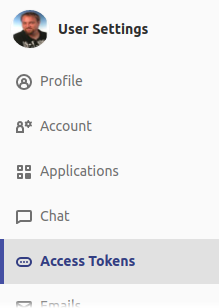

# PLICITY

An Open Source Node.js Cloud-Operator for Development by [consol](https://www.consol.de).

This project is "work in progress". Many features are still missing. Same for security. Don't use this version in production.


## Install

*Before using it, please also check Security section.*

The target folder has to exist and should be empty.

### 1. Initialize your project
```bash
npm init @plicity <target dir>
```

### 2. Commit plicity to your repository
```bash
git add -A
git commit -m 'add plicity'
git push
```

### 3. Update .env file

Go into your target directory and open `/plicity/.env`.

#### 3.1 Openshift Configuration

You can get url and token by copying your login command


It should look like this:

`oc login https://openshift.mycompany.org:8443 --token=abcdefghijklmnopqrstuvwxyz0123456789`

Use an openshift project which is already created for your app.

```bash
PLICITY_OPENSHIFT_URL=https://openshift.mycompany.org:8443
PLICITY_OPENSHIFT_TOKEN=abcdefghijklmnopqrstuvwxyz0123456789
PLICITY_OPENSHIFT_PROJECT=plicity-test
```

#### 3.2 Gitlab Configuration

*Note: Gitlab project needs to be public. Also see Security section.*

##### 3.2.1 `PLICITY_GITLAB_HOST`

Just the Gitlab host. Not the URL to the repository.

```bash
PLICITY_GITLAB_HOST=https://gitlab.mycompany.org
```

##### 3.2.2 `PLICITY_GITLAB_PROJECT_ID`

Go to your Gitlab Project and copy the `Project ID`.


```bash
PLICITY_GITLAB_PROJECT_ID=1147
```

##### 3.2.3 `PLICITY_GITLAB_TOKEN`

Go to `Settings`.


Go to `Access Tokens`.



Create Access Token.


```bash
PLICITY_GITLAB_TOKEN=abcdefghijklmnop
```

#### 3.3 Further PLICITY configuration

##### 3.3.1 `PLICITY_NAME`

Name of the Operator and used as prefix `$name-...` for all OpenShift resources. It has to only contain valid characters or it will crash.

```bash
PLICITY_NAME=pli
```

##### 3.3.1 `PLICITY_LOG_LEVEL`

*Just for local development of your Operator.*

Valid log level according to [pino](https://github.com/pinojs/pino) logger. In OpenShift it will run `info`.

```bash
PLICITY_LOG_LEVEL=debug
```

##### 3.3.1 `PLICITY_LOG_PRETTY`

*Just for local development of your Operator.*

Log output has json format. Make it human-readable setting this to `true`. In OpenShift it will output json.

```bash
PLICITY_LOG_PRETTY=true
```

### Example

```bash
mkdir demo-app
npm init @plicity demo-app
# npx: installed 123 in 9.758s
# ✔ copied 10 files to demo-app
# ✔ install dependencies
# ✔ add scripts - write demo-app/plicity/package.json
# ℹ 1. please commit and push
# ℹ 2. update demo-app/plicity/.env
# ℹ 3. initialize openshift: `cd demo-app/plicity; npm run init`.

cd demo-app/plicity
cat .env
# PLICITY_OPENSHIFT_URL=https://openshift.mycompany.org:8443
# PLICITY_OPENSHIFT_TOKEN=abcdefghijklmnopqrstuvwxyz0123456789
# PLICITY_OPENSHIFT_PROJECT=plicity-test
# 
# PLICITY_GITLAB_HOST=https://gitlab.mycompany.org
# PLICITY_GITLAB_TOKEN=abcdefghijklmnop
# PLICITY_GITLAB_PROJECT_ID=1147
# 
# PLICITY_NAME=pli
# PLICITY_LOG_LEVEL=debug
# PLICITY_LOG_PRETTY=true

npm run init
# > plicity@1.0.0 init demo-app/plicity
# > plicity init
# 
# INFO  (…openshift/oc.js): using KUBECONFIG /tmp/.kube/config
```

Check OpenShift to see Operator build.


When Operator POD is up and running all branches will be deployed.


### Advanced Settings

If you want to use your own registry:

```bash
npm init @plicity <target dir> \
  --npm-registry=http://registry.mycompany.org \
  --npm-strict-ssl=false
```

## Security

Good things first:

- No OpenShift cluster admin rights needed.
- Your OpenShift token **is not** exposed. The Operator will run with a special `ServiceAccount` with a `RoleBinding` allowed to control your project. Your token is just used for the initial setup or if you want to run the Operator local, e.g. updating it.

Need of improvement:

- Gitlab project needs to be public. Yet no authentication implemented.
- We give full Gitlab access to the Operator. Assumption is that the only API call we need at current is to add and remove the badge to the Gitlab project. This may change when implementing authentication for OpenShift for Gitlab.
- Your Gitlab Token is exposed as OpenShift secret. Everyone with access to your project can use that Gitlab token.

Grey zone:

- download OpenShift client `oc` from https://github.com/openshift/origin/releases/download/v3.11.0/openshift-origin-client-tools-v3.11.0-0cbc58b-linux-64bit.tar.gz. Customizable alternative location to be implemented.
